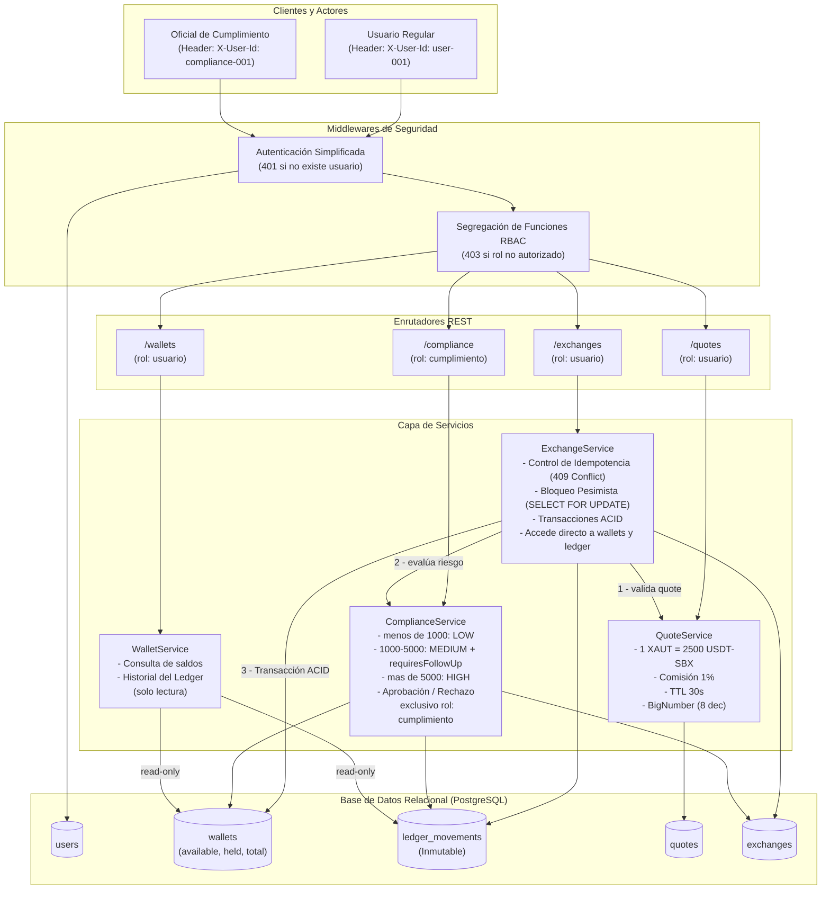

# Prueba Líder Técnico Full-Stack — Plataforma de Activos Digitales

## 1. Quickstart (3 Comandos)

Para levantar la base de datos PostgreSQL en Docker, correr las migraciones/seeds y ejecutar la suite completa de pruebas automatizadas:

```bash
# 1. Copiar variables de entorno
cp .env.example .env

# 2. Levantar servicios (PostgreSQL + API con seed automático)
docker compose up -d --build

# 3. Correr la suite de pruebas (41 tests de integración, escenarios a-j cubiertos)
docker compose exec api npm test
```

> **Nota para desarrollo local:** Si prefieres correr las pruebas directamente en tu host con `npm test`, ejecuta previamente `npm install`.

> **Base URL:** `http://localhost:3000`  
> **Swagger UI Interactivo (OpenAPI):** `http://localhost:3000/api-docs` _(para probar los endpoints directamente desde el navegador)_  
> **Health Check:** `http://localhost:3000/health`  
> **Mockup en Canva:** [Abrir prototipo en Canva](https://canva.link/v9hru0v0ig3ifsi)  
> **Colección Postman:** [`docs/exchange-api.postman_collection.json`](docs/exchange-api.postman_collection.json)

---

## 2. Usuarios y Datos Iniciales

Al iniciar el contenedor, la base de datos se inicializa con los usuarios requeridos:

| Identificador (`X-User-Id`) | Rol            | USDT-SBX            | XAUT-SBX       | Permisos y Alcance                                                                       |
| :-------------------------- | :------------- | :------------------ | :------------- | :--------------------------------------------------------------------------------------- |
| `user-001`                  | `Usuario`      | **10,000.00000000** | **0.00000000** | Consulta wallets, solicita cotizaciones, ejecuta intercambios y revisa su historial.     |
| `compliance-001`            | `Cumplimiento` | **0.00000000**      | **0.00000000** | Revisa la bandeja de operaciones retenidas (`> 5000 USDT`), aprueba o rechaza con notas. |

_Nota:_ El balance inicial de `user-001` cuenta con su respectivo movimiento de apertura en el ledger con referencia `INITIAL_SEED`.

---

## 3. Diagrama de Arquitectura

El siguiente diagrama modela el flujo end-to-end entre actores, capas de seguridad, servicios de negocio, control de concurrencia y persistencia:



---

## 4. Matriz de Cobertura de Pruebas Automatizadas

La solución cuenta con **41 pruebas automatizadas** implementadas en Vitest que se ejecutan en $\approx 4\text{ segundos}$, cubriendo todos los escenarios obligatorios y algunas pruebas adicionales:

| Escenario Requerido                                   | Archivo de Prueba                                 | Caso de Prueba / Verificación                                                                                              |   Estado    |
| :---------------------------------------------------- | :------------------------------------------------ | :------------------------------------------------------------------------------------------------------------------------- | :---------: |
| **a. Intercambio exitoso con riesgo LOW**             | `tests/exchanges.test.ts`                         | Monto $< 1000$ USDT ejecuta automáticamente, status `COMPLETED`, genera movimientos débito/crédito.                        | ✅ **PASS** |
| **b. Operación MEDIUM completada con seguimiento**    | `tests/exchanges.test.ts`                         | Monto $1000 - 5000$ USDT ejecuta automáticamente, status `COMPLETED`, marca `requires_follow_up = true`.                   | ✅ **PASS** |
| **c. Saldo insuficiente**                             | `tests/exchanges.test.ts`                         | Intento de intercambio por monto mayor al disponible rechaza con `400 Bad Request` (`Insufficient balance`).               | ✅ **PASS** |
| **d. Cotización vencida**                             | `tests/exchanges.test.ts`                         | Intento de ejecución posterior a la ventana de 30 segundos rechaza con `400 Bad Request` (`Quote has expired`).            | ✅ **PASS** |
| **e. Repetición de la misma clave de idempotencia**   | `tests/exchanges.test.ts`                         | Reenvío de `POST /exchanges` con misma clave y mismo payload retorna la operación original sin duplicar movimientos.       | ✅ **PASS** |
| **f. Reutilización de clave con contenido diferente** | `tests/exchanges.test.ts`                         | Reenvío de misma clave de idempotencia con otro `quoteId` o payload retorna estrictamente `409 Conflict`.                  | ✅ **PASS** |
| **g. Operación HIGH retenida**                        | `tests/exchanges.test.ts`                         | Monto $> 5000$ USDT mueve fondos de `availableBalance` a `heldBalance`, status queda en `PENDING_REVIEW`.                  | ✅ **PASS** |
| **h. Aprobación de operación retenida**               | `tests/compliance.test.ts`                        | Oficial aprueba: debita saldo retenido USDT, acredita XAUT, status `COMPLETED`, estampa auditoría y notas.                 | ✅ **PASS** |
| **i. Rechazo de operación retenida**                  | `tests/compliance.test.ts`                        | Oficial rechaza: libera saldo retenido de vuelta al disponible, no acredita XAUT, status `REJECTED`, estampa notas.        | ✅ **PASS** |
| **j. Intento de aprobación sin rol de Cumplimiento**  | `tests/compliance.test.ts`                        | Usuario regular (`user-001`) intentando aprobar o rechazar recibe estrictamente `403 Forbidden`.                           | ✅ **PASS** |
| **Pruebas adicionales de robustez**                   | `tests/wallets.test.ts`<br>`tests/quotes.test.ts` | Invariantes matemáticas $Total = Available + Held$, precisión 8 decimales, aislamiento entre inquilinos y validación UUID. | ✅ **PASS** |

Para ejecutar todas las pruebas:

```bash
# Dentro del contenedor (sin requerir Node/npm en el host)
docker compose exec api npm test

# O directamente en el host (requiere npm install previo)
npm test
```

---

## 5. Decisiones Técnicas y Arquitectura

### 5.1 Precisión Monetaria sin Punto Flotante Binario

El estándar IEEE-754 de JavaScript (`number`) produce anomalías binarias inaceptables en finanzas (por ejemplo, `0.1 + 0.2 !== 0.3`).

- **Solución:** Todos los cálculos utilizan **`BigNumber.js`**.
- En base de datos, las columnas se definen como PostgreSQL **`decimal(24, 8)`**.
- El redondeo al calcular XAUT es estrictamente **hacia abajo** (`BigNumber.ROUND_DOWN`) para proteger a la tesorería de sobre-emisiones fraccionarias.

### 5.2 Ledger Interno Inmutable

- Ninguna wallet puede modificar sus saldos directamente.
- Todo débito, crédito o retención genera un registro inmutable en **`LedgerMovement`** con tipo, monto, saldo anterior, saldo posterior, timestamp estricto en UTC y referencia de la operación.
- Los registros no se eliminan ni se sobrescriben.

### 5.3 Control de Concurrencia y Doble Gasto

- En un entorno de alta concurrencia, dos solicitudes simultáneas podrían consumir el mismo saldo.
- **Mecanismo:** El servicio adquiere un **Bloqueo Pesimista a Nivel de Fila** (`setLock('pessimistic_write')` que emite `SELECT ... FOR UPDATE` en PostgreSQL) sobre las wallets dentro de la misma transacción ACID. Esto serializa las operaciones y hace que el doble gasto sea matemáticamente imposible.

### 5.4 Control de Idempotencia

- La creación de intercambios (`POST /exchanges`) exige el encabezado `Idempotency-Key`.
- Si se recibe la misma clave con el mismo contenido, se devuelve la respuesta original sin repetir movimientos contables.
- Si se reutiliza la misma clave con diferente contenido o usuario, la API responde con **`409 Conflict`**.
- Se implementa además captura del error PostgreSQL `23505` (`unique_violation`) para resolver colisiones concurrentes en el milisegundo exacto.

### 5.5 Sustitución de Autenticación para Producción (Pregunta Sección 3.2)

Para efectos de la prueba se utilizó el encabezado `X-User-Id`. En un entorno productivo regulado:

1. **Opción A — Módulo Interno de Autenticación (Self-Issued JWTs + 2FA):**
   - **Flujo Nativo:** Endpoints dedicados (`POST /auth/login`, `POST /auth/refresh`, `POST /auth/mfa/verify`).
   - **Credenciales y 2FA:** Hashing de contraseñas con **Argon2id** o **Bcrypt** y verificación obligatoria de segundo factor.
   - **Ciclo de Tokens:**
     - **Access Token:** JWT de corta duración (5–15 minutos). La validación de el AT puede ser realizada por el API server o por microservicios para no sobrecargar la base de datos.
     - **Refresh Token:** JWT http-only de larga duración (7–30 días), con rotación automática y revocación inmediata ante cambios de IP o fingerprint de dispositivo.
2. **Opción B — Proveedor de Identidad (IdP Corporativo / OIDC):**
   - Delegar la gestión de identidades a un IdP dedicado (Keycloak, Auth0, AWS Cognito) mediante **OAuth2 / OpenID Connect**.
   - La API valida tokens contra el endpoint **JWKS** (JSON Web Key Set), desacoplando totalmente las credenciales de los servicios transaccionales.

### 5.6 Evolución hacia un Ledger de Partida Doble (Pregunta Sección 3.4)

Actualmente el modelo implementa un ledger simplificado por wallet. Para evolucionar hacia un ledger partida doble ($\sum \text{Débitos} = \sum \text{Créditos}$):

1. **Cuentas y Categorías del Libro Mayor (Ledger Categories):**
   - `Pasivo_Saldos_USDT_Clientes`: Registra la deuda total en USDT que la plataforma custodia a favor de los usuarios.
   - `Pasivo_Saldos_XAUT_Clientes`: Registra la deuda total en oro (XAUT) que la plataforma custodia a favor de los usuarios.
   - `Ingresos_Comisiones_Intercambio`: Registra las ganancias comerciales de la plataforma por la comisión del 1%.
   - `Cuentas_Por_Pagar_Liquidez`: Registra la obligación neta pendiente de liquidar con el proveedor de liquidez externo.
   - `Custodia_Oro_XAUT`: Registra el activo en oro recibido del proveedor y bajo custodia de la plataforma.

2. **Asiento Contable de un Intercambio (Operación: 2,500 USDT por 0.99 XAUT con 25 USDT de comisión):**
   - **Pierna USDT (Movimiento en moneda de origen):**
     - **DÉBITO** a `Pasivo_Saldos_USDT_Clientes` por **2,500.00 USDT** _(Disminuye la deuda que la plataforma tiene con el usuario en USDT)_.
     - **CRÉDITO** a `Ingresos_Comisiones_Intercambio` por **25.00 USDT** _(Ganancia del 1% para la tesorería de la plataforma)_.
     - **CRÉDITO** a `Cuentas_Por_Pagar_Liquidez` por **2,475.00 USDT** _(Monto neto adeudado al proveedor de liquidez que entrega el oro)_.
     - _Balance:_ $\text{Débito } 2,500.00 = \text{Créditos } (25.00 + 2,475.00 = 2,500.00) \checkmark$
   - **Pierna XAUT (Movimiento en moneda de destino):**
     - **DÉBITO** a `Custodia_Oro_XAUT` por **0.99 XAUT** _(Ingreso del activo suministrado por el proveedor a la custodia de la plataforma)_.
     - **CRÉDITO** a `Pasivo_Saldos_XAUT_Clientes` por **0.99 XAUT** _(Aumenta el saldo que la plataforma custodia a favor del usuario)_.
     - _Balance:_ $\text{Débito } 0.99 = \text{Crédito } 0.99 \checkmark$
3. De esta forma, cada operación contable garantiza matemáticamente que $\sum \text{Débitos} = \sum \text{Créditos}$ con suma cero exacta.

### 5.7 Estrategia ante Fallas del Servicio de Cumplimiento (Pregunta Sección 3.7)

Antes de ejecutar un intercambio, la plataforma consulta el servicio de monitoreo transaccional. Si dicho servicio experimenta indisponibilidad o timeout:

1. **Principio Fail-Closed (Seguridad por Defecto):** La operación nunca se ejecuta a ciegas. Si el análisis de riesgo no puede completarse, la transacción se aborta de inmediato.
2. **Rollback e Integridad de Saldos:** Toda validación ocurre antes de alterar el ledger o dentro de la transacción ACID. Si la consulta falla, los saldos en USDT y XAUT permanecen 100% intactos.
3. **Estrategia para Producción:**
   - **Circuit Breaker:** Si el servicio empieza a fallar o responde con timeout, el _Circuit Breaker_ se abre y corta de inmediato todas las llamadas de red hacia ese servicio. Esto evita sobrecargar la API y previene que los hilos del servidor se queden esperando conexiones caídas (fast-fail).
   - **Resiliencia con Colas Asíncronas:** Las operaciones afectadas pueden derivarse a una cola de mensajes (ej. AWS SQS) en un estado controlado (`PENDING_RETRY`), de modo que un worker en segundo plano reintente la validación una vez el servicio externo se haya restablecido.

---

## 6. Respuestas a Preguntas de Diseño de la Sección 10

### a. Emisión y Colocación

_¿Cómo ampliaría la solución para soportar emisión de activos por tramos y una colocación inicial, evitando que lo colocado supere el suministro autorizado?_

- **Entidad de Emisión:** Crearíamos una entidad `AssetIssuance` que administre `authorized_supply`, `issued_supply`, y `circulating_supply`.
- **Control por Tramos:** Entidad tramo con cuotas, fechas y estado (`SCHEDULED`, `OPEN`, `FILLED`, `CLOSED`).
- **Protección a Nivel de Base de Datos:**
  - Un constraint check directamente en PostgreSQL: `CHECK (circulating_supply <= authorized_supply)`.
  - Toda colocación adquiere un bloqueo pesimista `SELECT ... FOR UPDATE` sobre el registro del activo emisor. Si la suma solicitada supera el remanente autorizado, la transacción falla atómicamente, imposibilitando sobre-colocaciones en casos de concurrencia.

### b. Transferencias Internas entre Usuarios

_¿Cómo implementaría transferencias internas entre usuarios preservando atomicidad, idempotencia y trazabilidad?_

- **Atomicidad:** Débito en origen y crédito en destino ocurren dentro de la misma transacción de base de datos.
- **Idempotencia:** La solicitud exige `Idempotency-Key`; un key único garantiza que reintentos de red no dupliquen transferencias.
- **Trazabilidad:** Se generan dos movimientos de ledger emparejados con la misma referencia `transfer_id`: un `DEBIT` en el remitente y un `CREDIT` en el receptor.

### c. Custodia y Conciliación con Wallet Omnibus (Fireblocks)

_¿Cómo conciliaría el total del ledger interno contra una wallet omnibus administrada mediante Fireblocks o una solución equivalente?_

- **Invariante de Solvencia:**
  $$\text{Balance On-Chain en Fireblocks} \ge \sum \text{Total del Ledger Interno (Clientes)} + \text{Fondos Propios de Tesorería}$$
- **Proceso Automatizado de Conciliación:**
  - Un job periódico (ej. cada hora o post-retiro masivo) consulta la API de balances on-chain de Fireblocks.
  - En la base de datos interna, calcula la sumatoria de todos los movimientos netos del ledger inmutable (`ledger_movements`), validando además su consistencia contra el saldo consolidado de las wallets.
  - Compara el saldo real en Fireblocks contra la sumatoria total del ledger interno.
- **Manejo de Discrepancias:**
  - Si `Balance Fireblocks < Total Ledger`, se dispara de inmediato una alerta de severidad crítica (Sev-1), se pausan retiros automáticos y se registra la diferencia en `reconciliation_audit_logs` para intervención de tesorería.

### d. Cumplimiento: Manejo de Indisponibilidad de Herramientas (Sumsub / Chainalysis)

_¿Cómo manejaría la indisponibilidad temporal sin permitir operaciones que requieran validación previa?_

- **Política Fail-Closed:** Las transacciones de alto riesgo o que requieren Travel Rule/screening **nunca deben auto-aprobarse**.
- **Cola de Reintento y Estado Retenido:**
  - Si la herramienta externa está caída, la operación pasa a `PENDING_REVIEW` con indicador `compliance_status = 'PENDING_VENDOR_RETRY'`.
  - Un worker en segundo plano (BullMQ/SQS) reintenta la consulta con backoff exponencial.
  - Ningún activo sale de la plataforma hasta que la herramienta emita el veredicto o el oficial de cumplimiento decida manualmente.

### e. Controles para Despliegue en Plataforma Regulada

_¿Qué controles técnicos, operativos y de seguridad implementaría antes de desplegar en producción regulada?_

- **Seguridad:** Cero secretos en código (gestión con AWS Secrets Manager / Vault), mTLS entre servicios.
- **Pistas de Auditoría WORM:** Envío de logs a almacenamiento inmutable (AWS S3 con Object Lock en modo Compliance) para cumplimiento legal.
- **Controles Operativos:** Principio de cuatro ojos para cualquier movimiento grande, se necesitan 2 personas para autorizar.
- **Integridad Técnica:** Pruebas de estrés y concurrencia continuas en CI/CD; escaneo SAST/DAST y auditoría de penetración periódica.

### f. Emisión On-Chain: Separación de Componentes

_¿Qué componentes deberían mantenerse separados entre lógica interna, contrato inteligente, custodia, auditoría y validación del respaldo?_

1. **Lógica Interna (Off-chain):** Gestiona la experiencia de usuario, matching y ledger interno. No custodia llaves privadas maestras.
2. **Contrato Inteligente (On-chain):** Contrato minimalista (ERC-20/ERC-3643) con permisos de emisión y quema restringidos a firmas institucionales.
3. **Custodia Institucional (MPC):** Solución MPC (Fireblocks / Copper) que custodia las llaves con políticas de múltiples aprobadores humanos.
4. **Auditoría Externa:** Auditoría de código estático y dinámico por firmas independientes antes de cualquier despliegue.
5. **Validación del Respaldo (Proof of Reserve):** Oráculos independientes (ej. Chainlink PoR) conectados a bóvedas de oro físicas que verifiquen el colateral antes de permitir cualquier acuñación on-chain.

---

## 7. Mockup de Frontend

Los mockups se realizaron en Canva usando el approach de mobile first y están disponibles para visualización pública:

- 🔗 **Enlace directo al Mockup en Canva:** [Ver prototipo en Canva](https://canva.link/v9hru0v0ig3ifsi)

### Pantallas modeladas:

1. **Panel del Usuario:** Wallets de USDT-SBX y XAUT-SBX con segregación de saldo disponible, retenido y total, junto con el historial de movimientos contables del ledger y un botón para iniciar un intercambio.
2. **Solicitud de Intercambio:** Entrada de monto origen, cálculo automático de comisión (1%), proyección del activo destino y temporizador regresivo de 30 segundos (TTL de la cotización).
3. **Resultado de la Operación:** Retroalimentación visual para los 5 escenarios requeridos (`COMPLETED`, `PENDING_REVIEW`, `REJECTED`, cotización vencida y saldo insuficiente).
4. **Bandeja y Detalle de Cumplimiento:** Cola de retención para el oficial (`compliance-001`) con clasificación por riesgo, campo para notas de auditoría y acciones de aprobación / rechazo.

---

## 8. Colección de API y Documentación Interactiva (Sección 9.1)

- **Swagger UI / OpenAPI:** Disponible localmente en `http://localhost:3000/api-docs` al levantar la aplicación. Permite inspeccionar esquemas y ejecutar peticiones directamente.
- **Colección Postman:** Archivo listo para importar disponible en [`docs/exchange-api.postman_collection.json`](docs/exchange-api.postman_collection.json), preconfigurado con variables de entorno (`baseUrl: http://localhost:3000`, `userAuth: user-001`, `complianceAuth: compliance-001`).

---

## 9. Declaración sobre Uso de Inteligencia Artificial (Sección 11)

En cumplimiento de la **Sección 11 ("Uso de inteligencia artificial")**:

- Se utilizaron herramientas de inteligencia artificial generativa (Gemini / Claude) como asistente de pair-programming y acelerador de desarrollo para: diseño inicial de scaffolding y plantillas de documentación.
- Como autor de esta entrega, **asumo el 100% de la responsabilidad técnica sobre el código, arquitectura y decisiones implementadas**

---

## 10. Tiempos y Supuestos

- **Tiempo Total Aproximado:** 12 horas de diseño, implementación y verificación.
- **Supuestos:** Entorno de base de datos cerrada con liquidez interna suficiente; tipos de cambio y comisiones comerciales parametrizadas de forma centralizada en `src/config/constants.ts`.
